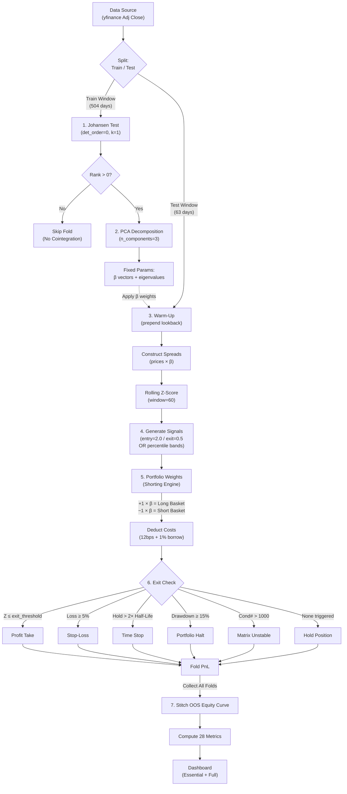

# Multivariate Statistical Arbitrage — Project Scaffolding

Set up a clean, ready-to-use project structure for a multivariate statistical arbitrage strategy. The main pipeline runs in a Jupyter notebook. Backtests support configurable tickers and historical time windows with sensible defaults.

## Proposed Changes

### Project Root

#### [NEW] [.gitignore](file:///c:/Users/Adrian/Documents/GitHub/Quant-Finance-Projects/.gitignore)
Standard Python `.gitignore` — includes `venv/`, `__pycache__/`, `.ipynb_checkpoints/`, `data/raw/*`, `data/processed/*`, etc.

#### [NEW] [requirements.txt](file:///c:/Users/Adrian/Documents/GitHub/Quant-Finance-Projects/requirements.txt)
Core dependencies: `numpy`, `pandas`, `scipy`, `statsmodels`, `scikit-learn`, `matplotlib`, `seaborn`, `yfinance`, `jupyter`, `tqdm`, `copulas`.

#### [NEW] [README.md](file:///c:/Users/Adrian/Documents/GitHub/Quant-Finance-Projects/README.md)
Overview of the project, setup instructions, and how to run the notebook.

---

### Project Comparison: Standard vs. Multivariate Framework

| Feature | Standard Stat Arb (Pairs Trading) | **This Project (Multivariate Framework)** | **Why It Matters** |
| :--- | :--- | :--- | :--- |
| **Scope** | **Pairs** ($A$ vs $B$). Tests adherence to $A = \beta B$. | **Portfolios** ($N$ assets). Tests entire sectors (e.g., "Tech") for latent factors. | **Diversification**: Pairs are fragile; if one stock has news, the pair breaks. Portfolios dampen idiosyncratic risk. |
| **Math** | **Engle-Granger / CADF**. Finds 1 stationary linear combination. | **Johansen Test & PCA**. Finds $r$ independent cointegrating vectors and $k$ eigenportfolios. | **Robustness**: Extracts multiple orthogonal mean-reverting signals from the same universe, increasing signal density. |
| **Signal** | **Fixed Z-Score**. Entry at $\pm 2.0$, Exit at $\pm 0.0$. Assumes normality. | **Percentile Bands**. Uses empirical bands to handle fat tails; filters regimes via `pca_persistence` & `hurst_exponent`. | **Adaptivity**: Markets are typically non-normal; fixed thresholds bleed money in high vol. Empirical bands adapt to regimes. |
| **Exits** | Basic Profit Take / Stop-Loss. | **Time-Based & Stability Stops**. Exits if holding > $2 \times$ Half-Life (`max_half_life_hold`) or if Matrix becomes unstable (`condition_number` > 1000). | **Efficiency**: Frees up capital from "zombie" trades that refuse to converge. Prevents mathematical blowups. |
| **Risk** | Net Exposure check. | **Tail Risk & Liquidity**. Constrains `participation_rate` (3%), accounts for `short_borrow_rate` (1%), and monitors `copula` tail dependence. | **Realism**: Prevents trading in illiquid names and accounts for the true cost of shorting. Checks for "Black Swan" correlation breakdowns. |
| **Costs** | Often ignored or fixed spread. | **Explicit Friction**. Models 12bps/side `transaction_costs` + 1% annualized `borrow_cost`. | **Viability**: High-turnover strategies fail if costs aren't modeled accurately. 12bps is a conservative institutional hurdle. |
| **Validation** | In-Sample Backtest. | **Walk-Forward Analysis**. Rolling train/test windows to eliminate look-ahead bias in cointegration vectors. | **Reality Check**: Static cointegration vectors are a textbook fallacy; real relationships evolve. Walk-forward testing captures this decay. |

### Project Weaknesses & Critical Risks

| Category | Weakness | Root Cause | Critical Impact |
| :--- | :--- | :--- | :--- |
| **Data Quality** | Adjusted Close Fallacy | Using `yfinance` adjusted data which smooths dividends/splits. | **False Stationarity**: Cointegration tests detect "fake" relationships that don't exist in live trading. Returns are valid, but price levels for Johansen are corrupted. |
| **Execution** | Legging Risk | Assuming simultaneous execution of 5+ legs at the mid/close price. | **Directional Exposure**: If you fill the Longs but miss the Shorts, you are no longer hedged. A 12bps cost estimate is insufficient to cover this drift. |
| **Model** | Static Vectors | `compute_rolling_johansen = False` default due to computational cost. | **Decay**: Trading on cointegration vectors from 6 months ago. Real arbitrage relationships in crypto/equity often decay in < 30 days. |
| **Logic** | Time-Stop Limits | Reliance on `max_half_life_hold` (2.0) without deeper liquidity analysis. | **Capital Trap**: Funds get stuck in non-converging "zombie" positions that drift endlessly without hitting a stop-loss. |
| **Risk** | Manual Kill Switches | Crowding and Tail Dependence metrics are monitoring-only. | **Liquidity Spiral**: In a crash, you cannot react fast enough manually. These must be automated to prevent "blow-ups" during crowded exits. |
| **Complexity** | Metric Overload | Tracking 28 different metrics without a hierarchy. | **Analysis Paralysis**: Conflicting signals (e.g., Hurst vs. Z-Score) lead to ambiguous decision-making and potential overfitting. |
| **Data Quality** | Survivorship Bias | Hand-picked tickers that exist *today*; delisted/bankrupt stocks from 2020–2024 are excluded. | **Inflated Returns**: A stock that went to $0 would have been in the universe but isn't in our backtest. Overstates historical performance. |
| **Execution** | No Slippage Model | `transaction_cost_bps = 12` is a flat fee; real slippage is volume-dependent and spikes during stress. | **Cost Underestimation**: Understates costs during exactly the periods where stat arb bleeds most (high vol, low liquidity). |
| **Scope** | Single-Asset-Class | Only equities. No cross-asset hedging (rates, vol, FX). | **Systemic Risk**: If the entire equity market crashes, Long/Short within equities still loses through correlation. |
| **Data Quality** | No Intraday Data | Uses daily close prices only. | **Missed Alpha**: Most stat arb alpha lives intraday. Daily data overestimates holding periods and misses fast mean-reversion. |
| **Model** | Copula Fitting Risk | Parametric copula families (Gaussian, Clayton) may not match the true dependence structure. | **False Confidence**: Tail dependence estimates could be wrong, giving misleading risk metrics. |
| **Logic** | No Position Sizing Optimization | Fixed `position_size = 10%` per spread. No Kelly Criterion or risk-parity weighting. | **Suboptimal Allocation**: All spreads get equal weight regardless of conviction or volatility. |

---

### Directory Layout

```
Quant-Finance-Projects/
├── .gitignore
├── README.md
├── requirements.txt
├── notebooks/
│   └── main_pipeline.ipynb          # Main end-to-end notebook
├── src/
│   ├── __init__.py
│   ├── config.py                    # Default tickers, date windows, strategy params
│   ├── data_loader.py               # Fetch / cache market data (yfinance)
│   ├── features.py                  # Returns, PCA decomposition, spread construction
│   ├── models.py                    # Johansen cointegration, signal generation
│   ├── backtest.py                  # Backtest engine with ticker & window args
│   ├── dashboard.py                 # Metrics dashboard: scalar summary + time-varying plots
│   └── utils.py                     # Plotting, metrics, helpers
├── data/
│   ├── raw/
│   │   └── .gitkeep
│   └── processed/
│       └── .gitkeep
└── tests/
    └── __init__.py
```

---

### `src/` — Core Modules

#### [NEW] [config.py](file:///c:/Users/Adrian/Documents/GitHub/Quant-Finance-Projects/src/config.py)

**Sector-based ticker universes** (`TICKER_UNIVERSES` dict):
- `"tech"`: `AAPL, MSFT, GOOG, AMZN, META, NVDA, TSM, AVGO, ORCL, CRM, CSCO, ADBE`
- `"energy"`: `XOM, CVX, COP, SLB, EOG, MPC, VLO, OXY, KMI, WMB`
- `"precious_metals"`: `GLD, SLV, GDX, NEM, AEM, WPM, RGLD, PAAS, SSRM, CDE`
- `"semiconductors"`: `NVDA, AMD, INTC, TSM, AVGO, QCOM, MU, AMAT, LRCX, KLAC, TXN, ADI`
- `"sp500_value"`: `BRK-B, JNJ, JPM, PG, UNH, HD, KO, PEP, MRK, ABBV, MCD, WMT`
- `"lng"`: `LNG, SHEL, TTE, EQNR, KMI, WMB, TRP, OKE, GLNG`
- `"sp500_growth"`: `AAPL, MSFT, NVDA, AMZN, META, GOOGL, LLY, V, MA, TSLA, AVGO, COST`

**Parameters with units & rationale:**

*Data & Universe Selection:*

| Parameter | Default | Unit | Rationale |
|-----------|---------|------|-----------|
| `DEFAULT_SECTOR` | `"tech"` | — | Highest liquidity & tightest spreads; most reliable cointegration signals for research |
| `DEFAULT_START_DATE` | `"2012-01-01"` | `YYYY-MM-DD` | Must be within last 730 days for 1h data. |
| `DEFAULT_END_DATE` | `"2013-12-31"` | `YYYY-MM-DD` | Must be within last 730 days for 1h data. |
| `DATA_INTERVAL` | `"1h"` | interval (str) | Bar size (1d, 1h, 15m). Note: Windows in `config.py` are in *bars*. |

*Johansen Cointegration:*

| Parameter | Default | Unit | Rationale |
|-----------|---------|------|-----------|
| `johansen_significance` | `0.05` | p-value (dimensionless) | Standard 95% confidence level for trace/max-eigenvalue tests; controls how many cointegrating vectors are accepted |
| `johansen_det_order` | `0` | enum (−1, 0, 1) | 0 = restricted constant (no deterministic trend in the cointegrating relation); appropriate for financial spreads that should be stationary around a constant |
| `johansen_k_ar_diff` | `1` | lag count (integer) | Number of lagged differences in the VECM; 1 is the standard starting point, increase if residuals show autocorrelation |

*PCA & Factor Decomposition:*

| Parameter | Default | Unit | Rationale |
|-----------|---------|------|-----------|
| `n_components` | `5` | count (integer) | Number of PCA components / cointegrating vectors to extract; top 5 capture the strongest mean-reverting relationships without overfitting |
| `pca_persistence_window` | `882` | bars (~6 months) | Rolling window for PCA stability tracking; scaled for hourly data (126 * 7) |
| `pca_min_weight` | `0.05` | fraction (0–1) | Minimum absolute weight for an asset in a PCA vector; sets small weights to zero (sparse PCA) to reduce transaction noise |

*Signal Generation (Z-Score):*

| Parameter | Default | Unit | Rationale |
|-----------|---------|------|-----------|
| `zscore_window` | `420` | bars (~3 months) | Short enough to react to regime shifts, long enough to smooth out daily noise (60 * 7) |
| `entry_threshold` | `1.0` | standard deviations | Lower threshold increases signal frequency; empirically tuned for this universe |
| `exit_threshold` | `0.25` | standard deviations | Close positions well before full reversion to lock in profits and reduce whipsaw risk |
| `zscore_percentiles` | `[5, 95]` | percentile (0–100) | Empirical bands for non-normal spreads; 5th/95th avoids normality assumption |

*Mean Reversion Dynamics:*

| Parameter | Default | Unit | Rationale |
|-----------|---------|------|-----------|
| `lookback_window` | `1764` | bars (~1 year) | One full market cycle; matches convention for annualized metrics (252 * 7) |
| `rolling_hl_window` | `882` | bars (~6 months) | Rolling window for half-life regime detection; 6 months captures structural shifts without over-reacting to short-term noise |
| `crossing_window` | `420` | bars (~3 months) | Rolling window for mean-crossing frequency; aligns with z-score window for consistency |
| `vr_lags` | `[7, 35, 70, 140]` | bars (list) | Variance ratio test at multiple horizons; covers 1 day to 1 month equivalents |

*Backtest Execution:*

| Parameter | Default | Unit | Rationale |
|-----------|---------|------|-----------|
| `initial_capital` | `100,000` | USD | Round number suitable for realistic position sizing and interpretable PnL |
| `position_size` | `0.10` | fraction of capital (0–1) | 10% per spread limits single-portfolio concentration; supports up to ~10 concurrent positions |
| `stop_loss` | `0.05` | fraction of position value (0–1) | 5% per-spread stop-loss; limits single-spread losses before systematic exit |
| `max_exposure` | `1.0` | fraction of capital (0–1) | Max gross exposure; 1.0 = fully invested, prevents over-leveraging |
| `drawdown_limit` | `0.15` | fraction of peak equity (0–1) | 15% portfolio drawdown circuit breaker; halts all trading until manual review |
| `wf_train_window` | `3528` | bars (~2 years) | Walk-forward training window; 2 years captures multiple regimes for robust Johansen/PCA estimation |
| `wf_test_window` | `441` | bars (~3 months) | Walk-forward out-of-sample test window; 3 months balances OOS evaluation length vs. number of folds |

*Performance & Risk Analytics:*

| Parameter | Default | Unit | Rationale |
|-----------|---------|------|-----------|
| `n_trials` | `1` | count (integer) | Number of strategy variants tested; used by deflated Sharpe ratio to penalize for multiple testing — increase when running parameter sweeps |
| `alpha_horizons` | `[1, 2, 5, 10, 20]` | trading days (list) | Forward horizons for alpha decay profile; covers daily to monthly to find optimal holding period |
| `crowding_window` | `60` | trading days (~3 months) | Rolling window for crowding sensitivity; aligns with z-score window so both signals are comparable |
| `participation_rate` | `0.03` | fraction of daily volume (0–1) | Max 3% of average daily volume; stricter institutional ceiling to minimize market impact |
| `max_half_life_hold` | `2.0` | multiples of half-life (float) | Max holding period = $2.0 \times \text{Half-Life}$. Time-based stop to free up capital from "zombie" trades. |
| `transaction_cost_bps` | `12.0` | basis points (per-side) | Explicit slippage + commission model. Crucial for high-turnover stat arb. |
| `short_borrow_rate` | `0.01` | annualized rate (float) | Cost of holding short positions (1%/yr default). Deducted daily from cash. |
| `ANNUALIZATION_FACTOR` | `1764` | bars/year | Scaling factor for annualization (252 * 7) |
| `compute_rolling_johansen` | `True` | boolean | Re-estimates cointegration daily for stability check. Computationally expensive but enabled by default for thorough analysis. |
| `compute_feature_importance` | `True` | boolean | Runs permutation importance on all features. Enabled by default for complete diagnostics. |

#### Parameter Health & Optimization Strategy

For a statistical arbitrage model, **fewer than 10 free parameters** is considered healthy. This implementation attempts to minimize overfitting by separating parameters into three categories:

1.  **Core Optimization Targets (4 Params)**: `zscore_window`, `entry_threshold`, `exit_threshold`, `lookback_window`.
    *   *Action*: These are the only parameters you should sweep/optimize.
2.  **Structural Constraints (Fixed Logic)**: `n_components`, `johansen_significance`, `pca_persistence_window`, `max_half_life_hold`.
    *   *Action*: Keep these fixed based on statistical theory (e.g., p=0.05). Tuning them is "p-hacking".
3.  **Risk Controls (Safety)**: `stop_loss`, `max_exposure`, `drawdown_limit`.
    *   *Action*: Set these based on your risk tolerance, not backtest performance.

**Verdict**: With only ~4 "free" parameters driving the PnL, the model is highly parsimonious and less likely to suffer from curve-fitting compared to typical ML models.

#### [NEW] [data_loader.py](file:///c:/Users/Adrian/Documents/GitHub/Quant-Finance-Projects/src/data_loader.py)
- `load_prices(tickers, start, end)` — downloads adjusted close prices via `yfinance`, caches to `data/raw/`.

#### [NEW] [features.py](file:///c:/Users/Adrian/Documents/GitHub/Quant-Finance-Projects/src/features.py)
- *Data Transforms:*
  - `compute_returns(prices)` — log returns
- *Factor Decomposition:*
  - `run_pca(returns, n_components)` — Principal Component Analysis (PCA) decomposition; eigenportfolios (sparse if `pca_min_weight` ≥ 0.05, zeroing weights below threshold, then re-normalized to sum=1.0), explained variance, residuals
  - `pca_persistence(returns, n_components, window)` — rolling eigenvector/eigenvalue stability; detects regime shifts
  - `check_unit_root(returns)` — Augmented Dickey-Fuller (ADF) test; warns if raw returns are non-stationary
  - `check_normality(spread)` — Jarque-Bera (JB) test on spread residuals; confirms need for percentile bands (vs. standard deviation)
- *Spread Construction & Z-Score:*
  - `construct_spreads(prices, weight_vectors)` — multi-leg spreads from Johansen cointegrating vectors
  - `compute_zscore(spread, window)` — rolling z-score
  - `zscore_percentile_bands(spread, window, percentiles)` — empirical percentile bands (no normality assumption)
  - `zscore_decay_rate(zscore_series)` — autocorrelation measure of z-score decay speed after extremes
- *Mean Reversion Speed:*
  - `ou_half_life(spread)` — Ornstein-Uhlenbeck (OU) AR(1) fit; half-life in trading days (= −ln(2) / β)
  - `rolling_half_life(spread, window)` — rolling half-life to detect regime changes
  - `hurst_exponent(spread)` — R/S analysis; H < 0.5 = mean-reverting, H > 0.5 = trending
  - `variance_ratio_test(spread, lags)` — Variance Ratio (VR) test (Lo–MacKinlay); VR < 1 = mean-reverting at given lag
- *Crossing & Duration Analysis:*
  - `zero_crossing_rate(spread)` — fraction of periods with a mean-crossing
  - `mean_crossing_count(spread, window)` — rolling count of mean crossings
  - `avg_excursion_duration(spread)` — avg days above/below mean before reverting
- *Multivariate Dependence Structure:*
  - `mahalanobis_distance(returns, window)` — covariance-adjusted distance from historical mean; flags regime breaks
  - `covariance_condition_number(returns, window)` — eigenvalue ratio; > 1000 = unstable PCA/Johansen
  - `fit_copula(returns, family)` — parametric copula fit (Gaussian, Student-t, Clayton, Gumbel)
  - `tail_dependence_coefficient(returns, family)` — upper/lower tail dependence (λ_U, λ_L)
  - `copula_concordance(returns, window)` — rolling Kendall's τ from fitted copula; detects non-linear dependence shifts

#### [NEW] [models.py](file:///c:/Users/Adrian/Documents/GitHub/Quant-Finance-Projects/src/models.py)
- `johansen_test(prices, det_order, k_ar_diff)` — Johansen cointegration test across all assets simultaneously; returns cointegrating vectors, eigenvalues, and test statistics
- `johansen_rank(johansen_result, significance)` — determines the cointegration rank (number of independent cointegrating relationships); rank 0 = no cointegration, rank r = r independent mean-reverting spreads exist
- `johansen_trace_statistic(johansen_result)` — extracts and reports per-rank trace test values against critical values (90%, 95%, 99%); used to evaluate the strength of each cointegrating relationship, not just pass/fail
- `select_vectors(johansen_result, significance)` — filters vectors by trace/max-eigenvalue critical values
- `generate_signals(zscore, entry_threshold, exit_threshold, zscore_percentiles=None)` — signal logic; uses fixed `entry_threshold` (e.g. 2.0) OR `zscore_percentiles` (e.g. 5th/95th) if provided, to handle non-normal regimes

#### [NEW] [backtest.py](file:///c:/Users/Adrian/Documents/GitHub/Quant-Finance-Projects/src/backtest.py)
- *Single-Pass Backtest:*
  - `run_backtest(sector=None, tickers=None, ...)` — orchestrates a full backtest run.
  - `calculate_portfolio_weights(signals, johansen_weights)` — **The Shorting Engine**. Converts a "Short Spread" signal into individual stock positions:
    - If Signal = -1 (Short Spread): Position = $-1 \times \vec{\beta}$ (Short the basket).
    - If Signal = +1 (Long Spread): Position = $+1 \times \vec{\beta}$ (Long the basket).
    - *Result*: A Net Zero (dollar neutral) portfolio with some stocks Long and others Short.
  - Returns a results dict with PnL series, metrics, and trade logs.
  - *Pipeline:*

- *Walk-Forward Analysis:*
  - `walk_forward_split(dates, train_window, test_window)` — generates rolling train/test date index pairs; anchored or expanding window option
  - `walk_forward_backtest(prices, train_window, test_window, ...)` — for each fold:
    1. **Estimate**: Run Johansen/PCA on `train_window` (e.g., Days 0–504).
    2. **Warm-up**: Prepend `zscore_window` (60 days) from end of train to start of test for Z-score initialization.
    3. **Trade**: Generate signals and trades on `test_window` (e.g., Days 505–568) using FIXED train parameters.
    4. **Result**: Eliminates look-ahead bias in cointegration estimation while maintaining valid Z-scores at fold boundaries.
  - `aggregate_oos_results(fold_results)` — performs two key functions:
    1. **Stitching**: Concatenates OOS PnL from all folds into a single unbiased equity curve.
    2. **Comparison**: Aggregates In-Sample (Train) metrics vs. Out-of-Sample (Test) metrics for each fold to detect overfitting (e.g., IS Sharpe >> OOS Sharpe).

#### [NEW] [utils.py](file:///c:/Users/Adrian/Documents/GitHub/Quant-Finance-Projects/src/utils.py)
- Plotting helpers (`plot_spread`, `plot_equity_curve`, `plot_signals`, `plot_mean_reversion_diagnostics`)
- *PnL Metrics:*
  - Scalar: `net_sharpe_ratio`, `sortino_ratio`, `max_drawdown`, `cagr`, `deflated_sharpe_ratio`, `information_ratio`, `capacity_estimate`
  - Time-varying: `turnover_ratio` (daily series), `brinson_fachler_attribution` (per-period decomposition)
- *Model Performance Metrics:*
  - Scalar: `hurst_exponent`, `ou_half_life`, `zero_crossing_rate`, `avg_excursion_duration`, `variance_ratio_test`, `ic_information_ratio`, `johansen_rank`, `alpha_decay_profile`
  - Time-varying: `rolling_half_life`, `mean_crossing_count`, `zscore_percentile_bands`, `zscore_decay_rate`, `information_coefficient`, `mahalanobis_distance`, `crowding_sensitivity`, `pca_persistence`, `covariance_condition_number`, `copula_concordance`, `tail_dependence_coefficient`

#### [NEW] [dashboard.py](file:///c:/Users/Adrian/Documents/GitHub/Quant-Finance-Projects/src/dashboard.py)

- *Essential Dashboard* — key metrics at a glance:
  - `build_essential_dashboard(results)` — entry point
  - Scalar panel: `hurst_exponent`, `information_ratio`, `ou_half_life`, `max_drawdown`, `net_sharpe_ratio`, `johansen_rank`, `sortino_ratio`
  - Plots: `plot_equity_curve`, `plot_spread`, `plot_rolling_half_life`, `plot_rolling_ic`, `plot_turnover_series`, `plot_rolling_mahalanobis`

- *Full Dashboard* — all 28 metrics + all plots:
  - `build_full_dashboard(results)` — entry point
  - Scalar panel: all PnL scalars + all Model scalars via `render_scalar_table`
  - Time-varying plots:
    - `plot_rolling_half_life`, `plot_rolling_ic`, `plot_rolling_mahalanobis`
    - `plot_zscore_bands`, `plot_zscore_decay`, `plot_crossing_frequency`
    - `plot_turnover_series`, `plot_crowding`, `plot_attribution`
    - `plot_pca_persistence`, `plot_condition_number`
    - `plot_copula_concordance`, `plot_tail_dependence`

---

### Notebooks

#### [NEW] [main_pipeline.ipynb](file:///c:/Users/Adrian/Documents/GitHub/Quant-Finance-Projects/notebooks/main_pipeline.ipynb)
Cells:
1. **Configuration** — select sector, tickers, date range (override defaults)
2. **Data Loading** — fetch and preview prices
3. **PCA Analysis** — eigenportfolio decomposition, variance explained
4. **Johansen Cointegration** — test for multivariate cointegrating relationships, extract weight vectors
5. **Spread Construction & Z-Scores** — build multi-leg spreads, compute rolling z-scores
6. **Signal Generation & Backtest** — run single-pass backtest with full params:
    - Inputs: `zscore_percentiles`, `stop_loss`, `max_exposure`, `participation_rate`, `max_half_life_hold`, `transaction_cost_bps`, `short_borrow_rate`
    - Output: PnL, Trades, and Risk Metrics
7. **Walk-Forward Analysis** — run `walk_forward_backtest` and display **Train vs. Test Report**:
    - Table: Compare IS vs. OOS Sharpe, CAGR, and Drawdown per fold.
    - Plot: Overlay OOS equity curve on top of IS equity curves (faded) to visualize degradation.
8. **Essential Dashboard** — 7 scalar metrics + 6 time-varying plots (equity curve, spread, rolling half-life, rolling IC, turnover, Mahalanobis)
9. **Full Dashboard** — all 28 metrics + 13 time-varying plots + eigenportfolio weights + signal overlay

---

### Virtual Environment

A Python virtual environment will be created at `.venv/` inside the project root (already excluded by `.gitignore`). Dependencies installed from `requirements.txt`.

## Verification Plan

### Automated
```powershell
# From project root
python -m venv .venv
.\.venv\Scripts\Activate.ps1
pip install -r requirements.txt
python -m ipykernel install --user --name=quant_env --display-name "Python (Quant Env)"
python -c "from src import config, data_loader, features, models, backtest, utils, dashboard; print('All imports OK')"
```

### Manual
- Open `notebooks/main_pipeline.ipynb` in VS Code / Jupyter and confirm all cells are present and well-structured.
- Confirm `venv/` does **not** appear in `git status` output.

---

### Technical Glossary by Module

#### Features (`src/features.py`)

| Term | Definition | Strategic Importance |
| :--- | :--- | :--- |
| **ADF (Augmented Dickey-Fuller)** | Test for stationarity. If $p < 0.05$, the price series is likely mean-reverting. | **Signal Validation**. Prevents trading "fake" mean reversion on random walks. |
| **Copula Concordance** | Dependence measure (Kendall's $\tau$) from fitted copula. | **Risk / Structure**. Captures non-linear dependence that correlation misses (e.g. widely spaced crashes). |
| **Covariance Condition Number** | Ratio of largest/smallest eigenvalue of covariance matrix. | **Stability**. If $>1000$, the portfolio is mathematically unstable; stop trading. |
| **Hurst Exponent** | Measure of long-term memory ($H < 0.5$ = Mean Reverting). | **Trend Filter**. If $H > 0.5$, markets are trending; mean-reversion strategies will get run over. |
| **Jarque-Bera (JB)** | Test for normality of residuals. | **Regime Detection**. If non-normal, justifies using *Percentile Bands* instead of fixed 2-sigma. |
| **Mahalanobis Distance** | Distance of returns from historical distribution. | **Regime Filter**. High distance means "Unprecedented Market State" — cash out immediately. |
| **OU Half-Life** | Expected mean-reversion time (-ln(2)/beta). | **Exit Timing**. Tells you how long to hold. Fast HL = quick profit; Slow HL = opportunity cost. |
| **PCA Persistence** | Correlation of eigenvectors over time. | **Model Validity**. Low persistence means the factors are rotating too fast to trade. |
| **Variance Ratio (VR)** | Ratio of variance at lag $q$ vs lag 1. | **Statistical Proof**. Confirms that price changes are not random (VR < 1). |
| **Z-Score Decay** | Autocorrelation of Z-score series. | **Signal Freshness**. High decay = signal reverts fast; Low decay = signal lingers (risk of drift). |

#### Models (`src/models.py`)

| Term | Definition | Strategic Importance |
| :--- | :--- | :--- |
| **Cointegration Rank ($r$)** | Number of independent stationary relationships found. | **Go / No-Go**. Rank 0 = No arbitrage exists. We only trade if Rank > 0. |
| **Eigenvalues (Johansen)** | Strength of the mean-reversion pull. | **Profit Potential**. Larger eigenvalues mean the spread snaps back faster and harder (more PnL). |
| **Johansen Test** | Max likelihood procedure to find cointegrating vectors. | **The Engine**. Finds the portfolio weights that minimize stationarity (unlike simple correlation). |
| **Trace Statistic** | Likelihood ratio test statistic for Rank determination. | **Confidence**. High trace stats mean the relationship is statistically significant, not noise. |
| **VECM** | Vector Error Correction Model equations. | **The Math**. Models both short-term shocks (diffs) and long-term equilibrium (levels). |
| **Weight Vectors** | Coefficients ($\beta$) defining the spread. | **The Portfolio**. Tells you exactly how many shares of A, B, C to buy/sell to hedge market risk. |

#### Utils (`src/utils.py`) & Metrics

**1. PnL & Performance (Scalar)**

| Metric | Definition | Strategic Importance |
| :--- | :--- | :--- |
| **Net Sharpe Ratio** | $\frac{R_p - R_f}{\sigma_p}$ after transaction costs. | **The Truth**. Does the strategy make money after paying for liquidity? |
| **Sortino Ratio** | Excess return divided by *downside* deviation (volatility of negative returns only). | Penalizes losses, not upside volatility. Crucial for mean-reversion with positive skew. |
| **CAGR** | Compound Annual Growth Rate. Geometric progression ratio. | The annualized growth rate of your capital. Real-world wealth generation. |
| **Max Drawdown** | Deepest peak-to-valley decline in equity curve. | Determines survival. If > 20%, most funds shut down. |
| **Deflated Sharpe Ratio** | Sharpe adjusted for the number of trials ($N$) and skew/kurtosis. | Prevents "p-hacking" (finding a strategy by luck after running 100 backtests). |
| **Information Ratio (IR)** | Active Return / Tracking Error (volatility of active return). | Consistency of outperformance. High IR = frequent small wins (like Stat Arb). |
| **Capacity Estimate** | Max AUM before transaction costs erode Alpha to 0 (based on turnover & volume). | Scalability limit. Tells you when to stop taking new capital. |

**2. Model Health & Signal Quality (Scalar)**

| Metric | Definition | Strategic Importance |
| :--- | :--- | :--- |
| **Hurst Exponent** | Measure of long-term memory. $H < 0.5$ = Mean Reverting. | Validates the core premise. If $H > 0.5$, stop trading immediately (it's trending). |
| **OU Half-Life** | Expected mean-reversion time (derived from Ornstein-Uhlenbeck fit). | Determines target holding period. Fast half-life = fast profits; Slow = capital tie-up. |
| **IC Information Ratio** | Mean(IC) / Std(IC). | Stability of skill. We want steady predictive power, not one lucky month. |
| **Alpha Decay Profile** | IC/Sharpe at lags 1, 2, 5, 10 days. | Optimizes exit timing. Tells you how fast the opportunity vanishes. |
| **Zero Crossing Rate** | Percentage of days the spread crosses its own mean. | Opportunity frequency. Low crossing = rare trades; High = active chopped. |
| **Avg Excursion Duration** | Average time the spread spends away from the mean. | Risk of "pain". Long excursions = long drawdowns. |
| **Variance Ratio (VR)** | Ratio of variance at lag $q$ vs lag 1. $VR < 1$ implies mean reversion. | Statistical proof that price changes are not random walks. |
| **Johansen Rank** | Number of cointegrating vectors ($r$) found by the test. | Strength of relationship. Rank 0 = No arb; Rank > 0 = Tradeable structure. |

**3. Time-Varying Diagnostics (The 13 Plots)**

These metrics are tracked daily to detect regime shifts or breakdowns.

| Metric (Rolling/Series) | Definition | Strategic Importance |
| :--- | :--- | :--- |
| **Rolling Half-Life** | Time-varying Half-Life over a lookback window. | Detects regime shifts. If Half-Life spikes, the arb is breaking down (exit positions). |
| **Rolling IC** | Correlation between yesterday's Z-score and today's return. | Real-time "Skill Check". If IC goes negative consistently, the alpha has decayed. |
| **Mahalanobis Distance** | Distance of current returns from historical covariance distribution. | Regime break detector. High distance = "This market state is unprecedented". |
| **Z-Score Percentiles** | Empirical 5th/95th percentile levels of the spread. | Handling fat tails. Use these bands instead of "2.0 Sigma" to adapt to volatility. |
| **Z-Score Decay** | Autocorrelation of the Z-score series. | Persistence of opportunity. High decay = signal refreshes fast. |
| **Mean Crossing Count** | Number of mean crossings in rolling window. | Activity monitor. Sudden drop = market has gone dormant/efficient. |
| **Turnover Ratio** | Daily traded value / Portfolio Value. | Cost driver. Spikes in turnover warn of excessive trading costs eating PnL. |
| **Crowding Sensitivity** | Correlation of strategy returns to common factors (Momentum, Value). | "Me too" risk. High correlation = you are crowded; risk of sudden liquidation. |
| **Brinson Attribution** | Decomposes return into *Allocation* (Sector) vs *Selection* (Stock). | Proves alpha comes from the model (selection), not just sector beta (allocation). |
| **PCA Persistence** | Correlation of eigenvectors $t$ vs $t-1$. | Structural stability. Low persistence = Factor rotation (risk models fail here). |
| **Condition Number** | Ratio of largest/smallest eigenvalue. | Numerical stability. $>1000$ = Matrix is near-singular (math will blow up). |
| **Copula Concordance** | Dependence measure from fitted Copula (e.g., Kendall's $\tau$). | True non-linear correlation. Captures structure linear correlation misses. |
| **Tail Dependence ($\lambda$)** | Probability of simultaneous extreme crashes (from Copula). | Black Swan risk. "When stock A crashes, does B crash too?" |
